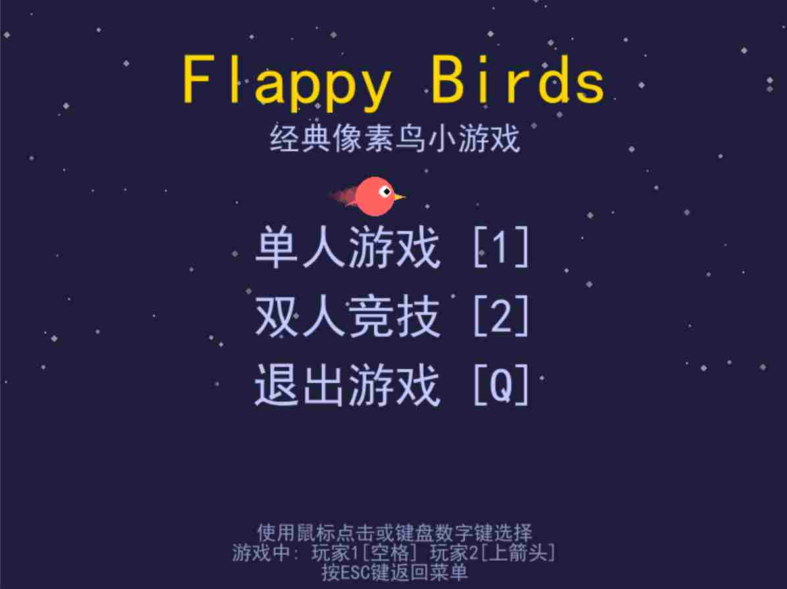
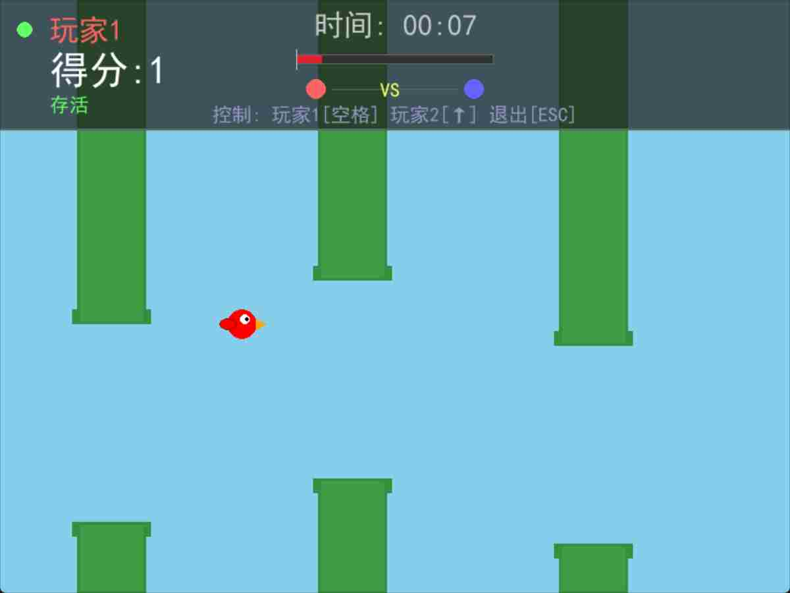
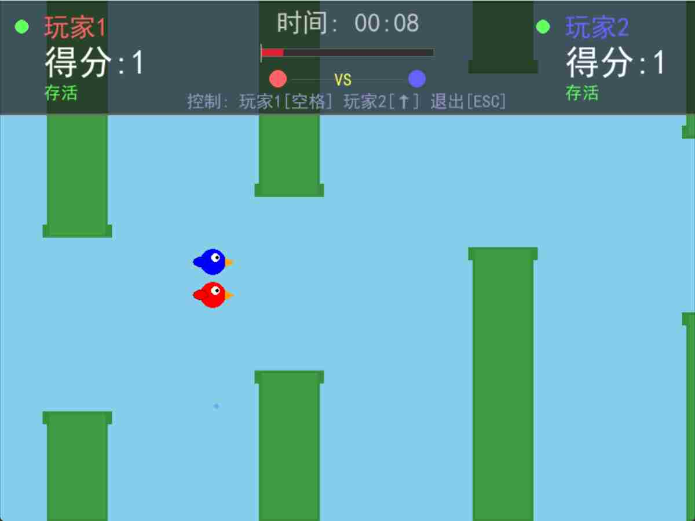
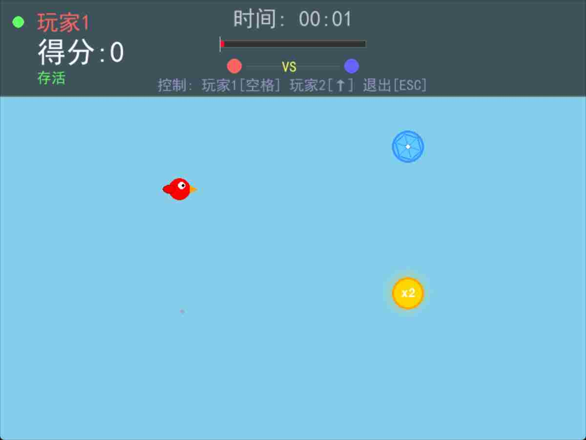

# Flappy Bird 游戏项目报告

## 1. 项目目标

本项目旨在重现并扩展经典的“Flappy Bird”游戏。核心目标是基于 Pygame 框架，构建一个功能完整、代码结构清晰、可扩展性强的游戏程序。

具体目标包括：
- **重现核心玩法**：实现小鸟通过点击屏幕（或按键）扇动翅膀，穿过管道缝隙的基本玩法。
- **扩展游戏模式**：在经典单人模式的基础上，创新性地加入 **双人同屏竞技模式**，增加游戏的互动性和趣味性。
- **丰富游戏元素**：引入 **道具系统**，包括“无敌护盾”和“得分翻倍”，为游戏过程增加更多策略和变数。
- **模块化代码设计**：采用面向对象的编程思想，将游戏的不同部分（如小鸟、管道、UI、碰撞检测）拆分为独立的模块，提高代码的可读性、可维护性和可扩展性。
- **完善的用户体验**：设计直观的主菜单、清晰的游戏中 HUD（抬头显示），并加入动画和视觉效果，提升整体游戏体验。

## 2. 游戏功能

- **单人模式 (Single-Player Mode)**：玩家控制一只小鸟，挑战自己的最高分。
- **双人竞技模式 (Two-Player Mode)**：两名玩家在同一屏幕上分别控制自己的小鸟，看谁能获得更高分或存活更久。
- **动态难度调整**：游戏的难度会随着分数的增加而提升，主要体现在管道的上下缝隙会逐渐变小，对玩家的操作提出更高要求。
- **道具系统 (Power-up System)**：
    - **无敌护盾**：拾取后，小鸟获得一个可以抵挡一次任何碰撞（管道或边界）的护盾。
    - **得分翻倍**：拾取后，在一定时间内，每次成功穿过管道的得分翻倍。
- **详细的 HUD 显示**：实时显示玩家得分、存活状态、游戏时间，并提供清晰的操作提示。
- **美观的 UI 设计**：包括带有动画效果的主菜单和游戏结束后的返回机制。

## 3. 实现说明

项目遵循模块化的设计原则，将游戏逻辑划分为 `game` 和 `ui` 两个核心包。

```
/
├── main.py             # 游戏主入口和循环
├── game/
│   ├── bird.py         # 小鸟类，处理玩家逻辑
│   ├── pipe.py         # 管道类和管道管理器
│   ├── powerup.py      # 道具类和道具管理器
│   └── collision.py    # 碰撞检测系统
└── ui/
    ├── hud.py          # 游戏中的抬头显示
    └── menu.py         # 游戏主菜单
```

### 3.1 数据与流程

游戏的主流程由 `main.py` 控制，它负责管理游戏状态（菜单、游戏中）。

1.  **启动游戏**：运行 `main.py`，初始化 Pygame，进入主菜单 (`MainMenu`)。
2.  **选择模式**：玩家在主菜单选择“单人游戏”或“双人竞技”。
3.  **进入游戏循环**：`main.py` 调用 `game_loop()` 函数，开始游戏。
    -   根据选择的模式，创建 1 个或 2 个 `Bird` 实例。
    -   创建 `PipeManager`、`PowerupManager`、`CollisionSystem` 和 `GameHUD` 的实例。
    -   **游戏主循环开始**：
        a.  **事件处理**：监听键盘事件（`SPACE`、`UP`、`ESC`）和退出事件。
        b.  **状态更新**：
            -   更新小鸟的位置（重力、跳跃）。
            -   更新管道和道具的位置（向左滚动）。
            -   `PipeManager` 根据时间动态生成新的管道。
            -   `PowerupManager` 根据通过的管道数量决定是否生成新道具。
        c.  **碰撞检测** (`CollisionSystem`)：
            -   检测小鸟与管道、边界的碰撞。
            -   检测小鸟与道具的碰撞。
            -   根据碰撞结果更新小鸟状态（如死亡、激活护盾、应用道具效果）。
        d.  **计分**：当小鸟的中心 x 坐标超过管道中心时，增加分数。
        e.  **渲染**：
            -   清空屏幕并绘制背景。
            -   绘制所有管道 (`PipeManager.draw`)。
            -   绘制所有道具 (`PowerupManager.draw`)。
            -   绘制所有存活的小鸟 (`Bird.draw`)。
            -   绘制 HUD (`GameHUD.draw`)。
        f.  **结束判断**：如果所有玩家都死亡，则结束 `game_loop`。
4.  **返回菜单**：`game_loop` 结束后，游戏状态切回“菜单”，重新显示主菜单界面。

### 3.2 关键模块设计

-   **`Bird` 类 (`game/bird.py`)**
    -   **属性**：位置 (`x`, `y`)、垂直速度 (`velocity_y`)、分数 (`score`)、存活状态 (`alive`)、控制按键 (`control_key`)、道具效果计时器等。
    -   **核心方法**：
        -   `flap()`: 给小鸟一个向上的瞬时速度，模拟扇动翅膀。
        -   `update(dt)`: 根据时间差 `dt` 更新小鸟状态。应用重力（`self.velocity_y += self.gravity * dt`），然后更新 `y` 坐标。
        -   `apply_powerup()`: 激活道具效果，并设置持续时间。
        -   `draw()`: 绘制小鸟及其视觉效果（如护盾、得分翻倍光效）。

-   **`PipeManager` 类 (`game/pipe.py`)**
    -   **职责**：管理游戏中所有管道的生成、移动和销毁。
    -   **核心方法**：
        -   `add_pipe()`: 在屏幕右侧创建一个新的 `Pipe` 对象，并赋予其唯一的 `pipe_id`。
        -   `update(dt)`: 根据 `dt` 和滚动速度 `scroll_speed` 更新所有管道的 `x` 坐标。移除已经移出屏幕左侧的管道以节省资源。
        -   `get_current_gap_height()`: **动态难度核心**，根据已生成的管道数量（间接代表分数）动态计算管道缝隙的高度，实现难度递增。

-   **`CollisionSystem` 类 (`game/collision.py`)**
    -   **职责**：提供独立的碰撞检测逻辑。
    -   **核心方法**：
        -   `check_bird_pipes()`: 检测小鸟（圆形）与所有管道（矩形）的碰撞。这是通过一个 `circle_rect_collision` 辅助函数实现的。
        -   `check_powerup_collision()`: 检测小鸟与道具的碰撞，基于两个圆形之间的距离判断。
    -   **设计优势**：将碰撞逻辑分离，使得 `Bird` 和 `Pipe` 类不需要关心彼此的内部实现，符合“高内聚，低耦合”的原则。如果未来引入新的碰撞物体，只需在 `CollisionSystem` 中添加新方法即可。

## 4. 核心算法/功能点深度解释

### 4.1 动态难度调整算法

-   **解释思路**：为了避免游戏难度一成不变，我们设计了一个动态调整管道缝隙高度的算法。当玩家分数较低时，缝隙较大，容易通过；随着分数增高，缝隙逐渐变小，挑战性增强。
-   **为何这么做**：这种设计能提供更平滑的学习曲线。新手玩家不会在早期就被过高的难度劝退，而高水平玩家也能在游戏后期持续感受到挑战。这比固定难度或线性难度变化能带来更好的游戏节奏感。
-   **实现方式**：在 `PipeManager` 的 `get_current_gap_height` 方法中实现。
    ```python
    def get_current_gap_height(self):
        score = self.next_pipe_id # 使用已生成的管道ID作为分数近似值
        if score > 10:
            # 使用指数衰减函数来平滑地减小缝隙高度
            k = -math.log(0.75) / 20 # 衰减系数
            p = score
            # 缝隙高度从初始值的100%逐渐衰减到60%
            gap_multiplier = 3/5 + (2/5) * math.exp(-k * (p - 10))
            return self.initial_gap_height * gap_multiplier
        else:
            return self.initial_gap_height # 初始阶段保持不变
    ```
-   **复杂度/效果对比**：
    -   **复杂度**：该算法的时间复杂度为 O(1)，每次调用仅涉及几次数学计算，对性能影响极小。
    -   **效果对比**：
        -   **固定难度**：容易让玩家感到单调。
        -   **线性难度** (`gap = initial - score * C`)：难度增长可能过快或过慢，且变化生硬。
        -   **指数衰减（本项目采用）**：在游戏初期难度基本不变，给玩家适应期；中期难度快速提升，增加挑战；后期难度增长放缓，趋于一个极限值，避免难度无限增高导致无法游戏。这种非线性变化更符合人类的适应和挑战心理。

### 4.2 圆形与矩形的碰撞检测算法

-   **解释思路**：游戏中的核心碰撞发生在圆形的小鸟和矩形的管道之间。精确的碰撞检测是游戏体验的基础。算法的核心是找到矩形上离圆心最近的点，然后判断该点与圆心的距离是否小于圆的半径。
-   **实现方式**：在 `CollisionSystem` 的 `circle_rect_collision` 方法中实现。
    ```python
    def circle_rect_collision(self, circle_x, circle_y, circle_radius, rect):
        # 1. 找到矩形上离圆心最近的点 (clamped_x, clamped_y)
        closest_x = max(rect.left, min(circle_x, rect.right))
        closest_y = max(rect.top, min(circle_y, rect.bottom))
        
        # 2. 计算该点与圆心的距离的平方
        distance_x = circle_x - closest_x
        distance_y = circle_y - closest_y
        distance_squared = distance_x**2 + distance_y**2
        
        # 3. 判断距离平方是否小于半径平方（避免开方运算，提高性能）
        return distance_squared <= (circle_radius**2)
    ```
-   **为何这么做**：
    -   **精确性**：相比于简单的矩形包围盒碰撞（将小鸟也视为矩形），这种方法能更精确地处理小鸟在管道边缘和角落的碰撞，避免了“看起来没碰到但却死了”的糟糕体验。
    -   **性能**：该算法只涉及比较和乘法运算，通过比较距离的平方和半径的平方，避免了昂贵的开方运算 (`math.sqrt`)，在每帧需要进行多次检测的游戏循环中，这是一个重要的性能优化。
-   **复杂度/效果对比**：
    -   **包围盒碰撞**：最快，但精度差。在小鸟旋转或非方形时，误差很大。
    -   **像素完美碰撞**：最精确，但性能开销巨大，需要逐像素比较，不适用于需要实时检测大量物体的场景。
    -   **圆形-矩形检测（本项目采用）**：在性能和精度之间取得了完美的平衡，是此类游戏中碰撞检测的理想选择。

## 5. 实验/演示结果与分析

### 5.1 主菜单界面



**分析**：主菜单设计简洁明了，使用了深色星空背景和金色标题，营造出经典的街机游戏氛围。菜单选项清晰，并提供了键盘快捷键提示。动态飞行的小鸟动画增加了界面的生动性。

### 5.2 单人游戏模式



**分析**：游戏中的 HUD 位于屏幕顶部，半透明的背景使其既清晰可见又不会过多遮挡游戏画面。HUD 内容详尽，包括玩家分数、存活状态、游戏时间以及操作提示，为玩家提供了完整的游戏信息。

### 5.3 双人竞技模式



**分析**：双人模式下，屏幕两侧分别显示两位玩家的信息。不同颜色的小鸟（红色 vs 蓝色）和对应的 HUD 区域使得玩家可以轻松区分彼此。这种同屏竞技的设计极大地增强了游戏的互动性和竞争乐趣。

### 5.4 道具效果展示



**分析**：
-   **无敌护盾**：如图所示，拾取护盾后，小鸟周围会出现一个蓝色的能量护盾视觉效果。此时即使碰到管道，小鸟也不会死亡，而是消耗护盾并获得短暂的无敌时间。
-   **得分翻倍**：拾取后，小鸟身上会散发金色的光芒，期间每次得分都会翻倍。
这些视觉效果为道具的激活提供了清晰的反馈，道具的引入也让游戏策略更加丰富。玩家可以选择冒险吃道具，也可能为了躲避道具而改变飞行节奏。

## 6. 总结与展望

本项目成功地使用 Pygame 实现了一个功能丰富、体验良好的 Flappy Bird 游戏。通过模块化的设计，代码结构清晰，易于维护。创新的双人模式和道具系统，以及动态难度调整算法，显著提升了游戏的可玩性和重玩价值。当然，本项目也有未能实现的失败之处，一开始希望通过逐渐增加小鸟与管道的相对速度来逐步增加游戏难度，但管道生成逻辑与时间的高度绑定使得速度的修改需要同时涉及时间与距离两个参数，修改难度较大，故最终放弃这一想法。

**未来可扩展方向**：
-   **积分榜**：增加本地或在线积分榜，记录玩家的最佳成绩。
-   **更多道具**：设计更多有趣的道具，如减速、穿墙等。
-   **自定义皮肤**：允许玩家选择不同的小鸟外观。
-   **关卡模式**：设计具有不同背景和障碍物组合的关卡。
